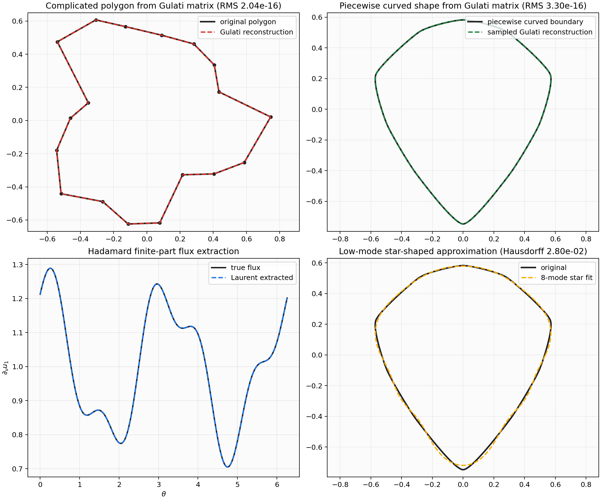
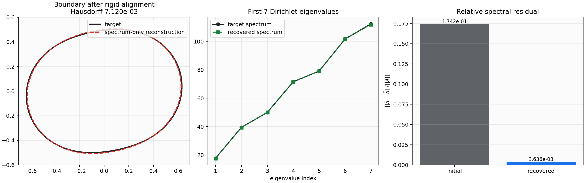

# Gulati Q Boundary Quadrature and PDE Engine

Standalone repository for the boundary-only Q quadrature, DtN/PDE, QBX
comparison, BGK/corner-correction, and shape-optimization work. The code is
curated from the larger research workspace so this repo contains the
quadrature/PDE package, tests, examples, benchmark artifacts, reports, and the
interactive drawing UI without unrelated nested projects or scratch caches.

## Interactive UI

Run the production Q UI backend:

```sh
PYTHONPATH=src python3 scripts/q_engine_ui_backend.py --host 127.0.0.1 --port 8790
```

Then open `http://127.0.0.1:8790/`. The UI starts blank, keeps drawn shapes as
boundary-only curves, and only runs the production Q solve after `Solve`.

## Symbol of Observation Certificate

The repository includes an executable audit for `symbol_of_observation (1).pdf`,
covering complex Spitzer algebra, strobe/zeta transfer, first-zero blindness,
FFT-Spitzer fluctuation constants, total-variation grading, and the unitary
sawtooth law. The pedagogical explanation, proof sketches, diagrams, and
reproduction command are in
[`outputs/symbol_of_observation/README.md`](outputs/symbol_of_observation/README.md).

## Beta Counterterm Certificate

The beta counterterm bridge is now executable as its own audit. It tests the
finite-cycle sum

```text
S_n(s) = sum_{k=1}^{n-1} [k (1-k/n)]^{-s}
```

against the ledger

```text
S_n(s) = n^(1-s) B(1-s,1-s)
       + 2 sum_j (s)_j zeta(s-j) n^(-j)/j!
       + residual.
```

The generated README explains why the beta term is the bulk continuum channel,
why the endpoint rungs are zeta/BGK repayments, and how this is the same
bookkeeping pattern as subtracting `pi R^2` before studying Gauss-circle error.
Current runs certify `O(n^-1)`, `O(n^-2)`, and `O(n^-3)` residual decay after
successive repayments on real and complex test cases.

```sh
PYTHONPATH=src python3 scripts/beta_counterterm_certificate.py \
  --out-dir outputs/beta_counterterm_certificate
```

Read the proof sketches, diagrams, and audit tables in
[`outputs/beta_counterterm_certificate/README.md`](outputs/beta_counterterm_certificate/README.md).

## Package Core

Production-oriented numerical primitives for inverse spectral and Hadamard shape
reconstruction in planar domains.

This repository accompanies the complete audibility manuscript in
[`audibility_complete_combined.tex`](audibility_complete_combined.tex). The code
does not claim to solve the full infinite-dimensional inverse spectral problem
from finitely many eigenvalues. It provides the tested computational layers that
the paper uses:

- inverse-square Gulati operators for sampled boundaries and polygons;
- reconstruction of labelled polygons from Gulati matrices or directed moments;
- Hadamard Hessian flux extraction via the finite-part Laurent coefficient;
- star-shaped low-mode Fourier fitting;
- finite-difference Dirichlet eigenvalue computation;
- constrained low-mode reconstruction from Dirichlet eigenvalues only;
- heat-trace coefficient fitting from finite spectral samples;
- a CLI and synthetic end-to-end demo.

## Install

```sh
python3 -m venv .venv
. .venv/bin/activate
python -m pip install -U pip
python -m pip install -e ".[dev,plot]"
```

For local development without a virtualenv, the tests can also be run with
`PYTHONPATH=src`.

## Quick Start

Run the synthetic reconstruction demo:

```sh
PYTHONPATH=src python -m inverse_shape.cli demo --out artifacts/demo --samples 160
```

This writes:

- `boundary.csv`: normalized sampled boundary;
- `gulati.npy`: serialized Gulati matrix;
- `gulati_reconstruction.csv`: MDS reconstruction from the Gulati matrix;
- `hadamard_residual.npy`: flux-dressed Hadamard residual model;
- `flux_true.csv` and `flux_recovered.csv`;
- `summary.json`: reconstruction diagnostics.

CLI entry points after installation:

```sh
inverse-shape summarize-boundary artifacts/demo/boundary.csv
inverse-shape polygon-from-gulati artifacts/demo/gulati.npy --out artifacts/demo/recovered.csv
inverse-shape flux-from-hessian artifacts/demo/boundary.csv artifacts/demo/hadamard_residual.npy --out artifacts/demo/flux.csv
inverse-shape dirichlet-spectrum artifacts/demo/boundary.csv --out artifacts/demo/eigenvalues.csv --count 8
```

## Visual Reconstruction Gallery

The repository includes a generated visual regression gallery:



Regenerate it with:

```sh
MPLCONFIGDIR=/tmp/mplconfig PYTHONPATH=src \
  python3 examples/reconstruction/visual_reconstruction_gallery.py --out-dir docs/assets
```

Current gallery diagnostics:

- complicated polygon from G: RMS `2.0e-16`;
- piecewise curved sampled boundary from G: RMS `3.3e-16`;
- Hadamard finite-part flux extraction: relative error `2.9e-16`;
- 8-mode star-shaped approximation of the piecewise curved boundary: Hausdorff `2.8e-2`.

## Dirichlet Spectrum Only Demo

The repo now includes a direct test of reconstruction using only Dirichlet
eigenvalues. This is intentionally a constrained finite-dimensional inverse
problem: the target is an area-normalized low-mode star-shaped domain, the data
are only the first finite-difference Dirichlet eigenvalues, and the optimizer is
not given the boundary, G matrix, flux, or Hadamard Hessian.



Regenerate it with:

```sh
MPLCONFIGDIR=/tmp/mplconfig PYTHONPATH=src \
  python3 examples/reconstruction/spectrum_only_reconstruction.py --out-dir docs/assets
```

Current spectrum-only diagnostics:

- first Dirichlet eigenvalues used: `7`;
- initial relative spectral residual: `1.74e-1`;
- recovered relative spectral residual: `3.64e-3`;
- boundary Hausdorff error after rigid-motion alignment: `7.12e-3`.

This is a positive sanity check for a low-dimensional spectral reconstruction
pipeline. It is not a claim that finitely many eigenvalues reconstruct arbitrary
domains; non-congruent isospectral examples and finite-data instability remain
real obstructions outside the constrained model.

## Library API

```python
import numpy as np
from inverse_shape.geometry import BoundaryCurve, StarShapeModel
from inverse_shape.operators import (
    apply_pressure_hessian_from_gulati,
    dressed_gulati_hessian,
    extract_flux_from_gulati_hessian,
    gulati_laplacian,
    pressure_gulati_energy_factor,
)
from inverse_shape.reconstruction import reconstruct_polygon_from_gulati
from inverse_shape.spectrum_inverse import reconstruct_star_shape_from_spectrum

model = StarShapeModel(
    center=np.array([0.0, 0.0]),
    base_radius=1.0,
    cos=np.array([0.12, -0.04, 0.03]),
    sin=np.array([0.0, 0.07, -0.02]),
)
curve = BoundaryCurve(model.boundary_points(160)).normalized()
gu = gulati_laplacian(curve.points)
recovered = reconstruct_polygon_from_gulati(gu)

theta = np.linspace(0, 2 * np.pi, curve.n, endpoint=False)
u = np.cos(theta)
energy = float(u @ (gu @ u))  # sampled <u, Gu> form
flux = 1.0 + 0.18 * np.cos(2 * theta)
h_res = dressed_gulati_hessian(curve.points, flux)
h_action = apply_pressure_hessian_from_gulati(gu, flux, u)
energy_factor = pressure_gulati_energy_factor(curve.points, flux)
flux_hat = extract_flux_from_gulati_hessian(gu, h_res)
```

## Mathematical Conventions

The inverse square boundary operator introduced by Gulati 2026 is denoted `G`.
Its finite Gulati matrices use

```text
G_ij = -|x_i - x_j|^-2,  i != j
G_ii = -sum_{j != i} G_ij
```

For sampled boundary data, `gu = gulati_laplacian(points)` is the matrix used in
quadratic forms written `<u, Gu>`.

## Gulati Cycle Quadrature

The regular-circle implementation from the optimal-quadrature note is available
as `inverse_shape.quadrature`. It includes the closed-form spectrum
`lambda_m = m(n-m)/2`, FFT application of `phi(G_n)`, pseudoinverse boundary
solves on the mean-zero subspace, heat/resolvent/wave/fractional propagators,
Cauchy-Gram factorization, and near-singular logarithmic layer evaluation on the
unit circle.

```python
from inverse_shape.quadrature import (
    apply_cycle_gulati,
    circle_log_layer_spectral,
    near_singular_circle_table,
    solve_cycle_gulati,
)
```

Run the numerical pressure suite with:

```sh
PYTHONPATH=src python3 scripts/pressure_test_gulati_quadrature.py \
  --max-power 16 --near-n 4096 --repeats 3 \
  --json docs/assets/gulati_quadrature_pressure.json
```

The checked pressure artifact reports exact constant-mode conservation through
`n = 65536`, boundary-solve residual `3.4e-12` at `n = 65536`, and at
`delta = 1e-6` the classical trapezoid relative error `2.6e-4` versus Gulati
spectral relative error `1.8e-16`.

For non-circular closed curves, run:

```sh
PYTHONPATH=src python3 scripts/pressure_test_offcircle_gulati.py \
  --json docs/assets/offcircle_gulati_pressure.json
```

This checks an ellipse, a smooth star-shaped curve, and a piecewise-curved
boundary for row-sum conservation, positive semidefiniteness, Cauchy-Gram
factorization, the local `pi/delta` coercivity law, and the principal Weyl slope
of paired low modes of `h G_n`.

To compare the local bridge correction against a point-QBX baseline on hard
non-circular shapes, run:

```sh
PYTHONPATH=src python3 scripts/pressure_test_qbx_comparison.py \
  --json docs/assets/qbx_comparison_pressure.json
```

The default suite uses the peanut, teardrop, wavy-star, asymmetric-gear, and
three-lobed finite-Fourier boundaries. With `n = 1024` source samples and
targets down to `delta/h = 0.05`, the checked artifact reports bridge
improvement over plain trapezoid in all 20 cases and a point-QBX baseline below
`5.2e-7` relative error against a high-resolution reference.

The global analytic claims from the optimal-quadrature note are separated into
repaired theorem statements in
[`docs/global_analytic_proof_repair.md`](docs/global_analytic_proof_repair.md).

For the Hadamard residual kernel,

```text
H_res(s,t) ~= (2/pi) p(s) p(t) / |gamma(s)-gamma(t)|^2
```

near the diagonal, where `p = partial_nu u_1`. Thus

```text
p(s)^2 = (pi/2) Coef_{epsilon^-2}[H_res(s, s + epsilon)]
```

in the continuum finite-part Laurent expansion. The sampled extractor solves the
corresponding log-linear product system from near-neighbor pairs.

Finite Gulati matrices make the pressure Hessian cheap to represent. Let
`D_p = diag(p)` and let `W` be the zero-diagonal positive adjacency

```text
W_ij = -G_ij = |x_i - x_j|^-2,  i != j
W_ii = 0.
```

Then the sampled zero-diagonal pressure Hessian is the diagonal dressing

```text
H_p = (2/pi) D_p W D_p,
(H_p u)_i = (2/pi) p_i sum_{j != i} W_ij p_j u_j.
```

So the geometry is stored once in `G`, pressure updates are diagonal scalings,
and the product identity becomes

```text
p_i p_j = -(pi/2) H_ij / G_ij,  i != j.
```

The conservative positive semidefinite companion is the dressed Gulati
Laplacian

```text
K_p = (2/pi) D_p G D_p = B_p.T B_p,
```

whose off-diagonal entries are `-H_ij`. In code this is
`pressure_hessian_from_gulati`, `apply_pressure_hessian_from_gulati`,
`extract_flux_from_gulati_hessian`, and `pressure_gulati_energy_factor`.

## Odd Dirichlet Trace Regularization

The correct finite-to-continuum regularization for odd Dirichlet signs is not a
raw signed cutoff.  The sign has to be carried by an odd theta characteristic,
equivalently by the prime-form/theta-Vandermonde geometry, so that the twist is
noncentral.

For the primitive odd character modulo `4`,

```text
chi_4(n) = 0,  n even
chi_4(n) = 1,  n = 1 mod 4
chi_4(n) = -1, n = 3 mod 4,
```

the Jacobi theta convention

```text
theta_1(z | tau)
  = 2 sum_{m>=0} (-1)^m q^{(m+1/2)^2} sin((2m+1)z),
q = exp(pi i tau),
```

gives, after differentiating at `z = 0` and setting `tau = i t`,

```text
(1/2) theta_1'(0 | i t)
  = sum_{m>=0} (-1)^m (2m+1)
      exp(-pi (2m+1)^2 t / 4)
  = sum_{n odd >= 1} chi_4(n) n exp(-pi n^2 t / 4).
```

Thus the odd character is encoded by the theta characteristic, not by multiplying
an otherwise positive canonical system by scalar signs.  Taking the Mellin
transform gives the completed odd Dirichlet trace.  For `Re(s) > 1`,

```text
int_0^infty t^{(s+1)/2 - 1} (1/2) theta_1'(0 | i t) dt
  = sum_{n odd >= 1} chi_4(n) n
      int_0^infty t^{(s+1)/2 - 1} exp(-pi n^2 t / 4) dt
  = Gamma((s+1)/2) (4/pi)^((s+1)/2)
      sum_{n odd >= 1} chi_4(n) n^{-s}
  = Gamma((s+1)/2) (4/pi)^((s+1)/2) L(s, chi_4).
```

The interchange of sum and integral is justified in the initial half-plane by
absolute convergence.  The resulting identity continues meromorphically, and in
this odd primitive case the completed function is entire.

The same Mellin calculation works for any primitive odd Dirichlet character
`chi` modulo `q` once its odd theta kernel is written as

```text
Theta_chi(t) = sum_{n>=1} chi(n) n exp(-pi n^2 t / q).
```

Then, initially for `Re(s) > 1`,

```text
int_0^infty t^{(s+1)/2 - 1} Theta_chi(t) dt
  = Gamma((s+1)/2) (q/pi)^((s+1)/2) L(s, chi).
```

For `chi_4`, `Theta_chi` is exactly `(1/2) theta_1'(0 | i t)`.  For general
primitive odd `chi`, it is the corresponding finite linear combination of
shifted odd theta characteristics, with Gauss-sum phases.  This is the
theta-Vandermonde/prime-form lift of the signed trace.

## Tests

```sh
PYTHONPATH=src pytest
```

The tests cover:

- geometry normalization and Fourier star-shape fitting;
- Gulati matrix construction and distance reconstruction;
- regular-cycle Gulati spectral calculus and near-singular quadrature;
- off-circle Gulati conservation, coercivity, and Weyl-slope diagnostics;
- Hadamard flux extraction from a dressed Gulati residual;
- finite-difference Dirichlet eigenvalue computation;
- constrained low-mode reconstruction from Dirichlet spectrum only;
- heat-trace coefficient fitting on synthetic data.

## Repository Layout

```text
src/inverse_shape/      package source
tests/                  unit tests
examples/reconstruction runnable examples
docs/                   algorithm notes
.github/workflows/ci.yml GitHub Actions CI
```

The older Fast Zeta Metal prototype files are left in place for reference, but
the production package in this repo is `inverse-shape`.
# drum
