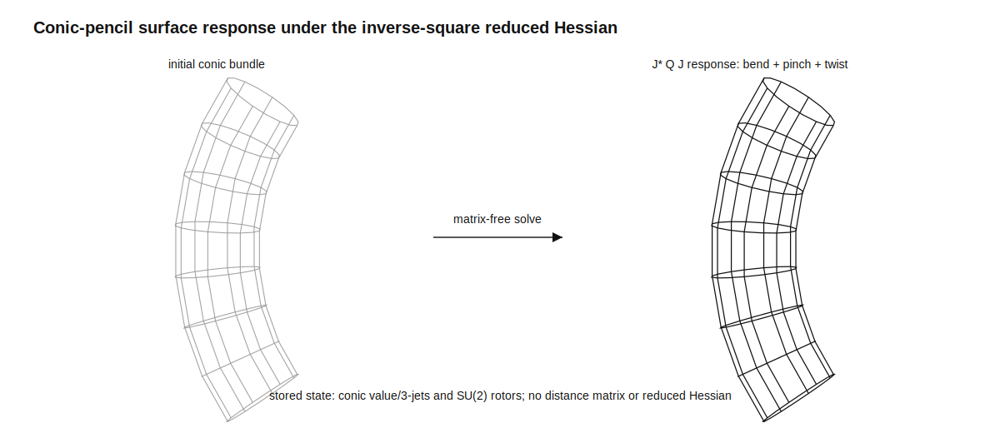

# Conic-pencil surface QJets

## Scope

This path represents a three-dimensional surface as a one-dimensional bundle
of planar conics. It is useful for tubes, bodies of revolution, bent and
twisted ducts, toroidal surfaces, and aircraft-like bodies. A general surface
requires several such charts and an overlap rule; one conic bundle is not a
global parameterization of every topology.

The implementation has two noninterchangeable operators:

1. an inverse-square graph metric used to compute shape response; and
2. the normalized inverse-cube principal channel of the three-dimensional DtN
   operator.

Both actions are matrix-free. The implementation stores conic three-jets and
field vectors, not pairwise distance, surface-operator, or reduced-Hessian
matrices.

## Surface generator

For a meridional coordinate `u` and angular coordinate `theta`, write

```text
X(u,theta) = c(u)
           + a(u) cos(theta) e1(u)
           + b(u) sin(theta) e2(u).
```

The moving orthonormal frame `(e1,e2,e3)` is represented by a unit quaternion
`r(u)`. Each sampled conic slice retains the value and first three `u`
derivatives of

```text
c(u), r(u), log(a(u)), log(b(u)).
```

This is 36 real scalars per slice:

```text
center:      4 x 3 = 12
quaternion:  4 x 4 = 16
log axes:    4 x 2 =  8
total:                 36.
```

The exponential parameterization of the axes enforces `a,b > 0`. Quaternion
normalization enforces an orthonormal moving frame. Surface nodes, tangents,
normals, and area weights are generated only for the duration of an operator
application.

The meridional tangent is differentiated from the retained jets rather than
rebuilt from neighboring rings. With world angular velocity

```text
omega(u) = 2 vec(r'(u) conjugate(r(u))),
```

the generated derivative is

```text
X_u = c' + (log(a))' a cos(theta) e1
         + (log(b))' b sin(theta) e2
         + omega x (X-c).
```

Thus deformation, normals, and area factors use the same QJet state.

Adjacent slices define a piecewise conic pencil. In a local homogeneous
conic chart,

```text
A(lambda) = A0 + lambda DeltaA,
DeltaA = A1 - A0.
```

The exact certificate used by the implementation is

```text
-d_lambda^2 log|det A(lambda)|
    = tr((A(lambda)^-1 DeltaA)^2).
```

If `det A(lambda) = C product_r (lambda-lambda_r)`, the same quantity is

```text
sum_r (lambda-lambda_r)^-2.
```

This is an `O(1)` inverse-square certificate for each 3 by 3 pencil. It detects
a degenerating conic chart. It is not a replacement for the physical
`|X_i-X_j|^-2` surface interaction. Centerline or frame degeneracy is detected
separately by the generated tangent-cell area.

## Matrix-free surface actions

Let `w_j` denote generated area weights. For `p=2` or `p=3`, define the
discrete graph action

```text
(Q_p f)_i = sum_(j != i) w_j (f_i-f_j) / |X_i-X_j|^p.
```

The direct reference streams each unordered pair once. It uses `O(N^2)` work
and `O(N)` storage. The production tree generates monopole, dipole, and
quadrupole moments for far blocks and repays unresolved leaves by exact pair
interactions. It uses `O(N)` stored moments and no dense matrix.

The two powers have different geometric meanings and scale laws:

```text
Q_2[s X] = Q_2[X],
Q_3[s X] = s^-1 Q_3[X].
```

Thus `Q_2` is a scale-invariant surface shape metric. The flat principal
symbol of the three-dimensional DtN operator is instead

```text
(D0 f)_i = (2*pi)^-1 (Q_3 f)_i.
```

The factor `1/(2*pi)` is the standard constant in the singular-integral
representation of `(-Delta_R2)^(1/2)`. The public method
`apply_dtn_principal` includes it.

For elliptical slices with `a>b`, `apply_same_slice_joukowski` replaces
same-ring inverse-square pairs by the static Joukowski endpoint compiler. This
local channel matches direct physical ring interactions at `3.23e-15` in the
twisted-tube audit. Cross-slice interactions are deliberately excluded from
that method; see `docs/joukowski_static_endpoint_calculus.md`.

The current Q3 benchmark tests tree compression against an independent direct
discretization. It is not yet a high-order continuum DtN benchmark. Such a
result additionally requires:

1. analytic repayment of the omitted tangent cell;
2. the lower-order geometry-dependent DtN operator; and
3. chart-overlap repayment for a multi-chart closed surface.

## Lowering geometry into QJet form

Each conic slice has eight infinitesimal shape parameters:

```text
delta p = (delta c_x, delta c_y, delta c_z,
           delta log(a), delta log(b),
           delta omega_x, delta omega_y, delta omega_z).
```

The geometry JVP is exact for this parameterization:

```text
delta X = delta c
        + delta log(a) a cos(theta) e1
        + delta log(b) b sin(theta) e2
        + delta omega x (X-c).
```

Let `J_p` map all slice parameters to generated node displacements. Its
weighted adjoint maps node forces back to translation, axis, and rotor
channels. The reduced shape metric is applied as

```text
delta p
  -> J_p delta p
  -> Q_2(J_p delta p)
  -> J_p^* W Q_2 J_p delta p.
```

No reduced Hessian is assembled. Its quadratic form is

```text
<delta p,H delta p>
  = 1/2 sum_(i,j) w_i w_j
      |delta X_i-delta X_j|^2 / |X_i-X_j|^2,
```

up to the optional ridge and shell-smoothness terms. This identity proves
positive semidefiniteness of the unreduced metric. Constant translations are
its nullspace; the ridge stabilizes that nullspace, while shell smoothness
controls high-frequency variation between conic slices.

Solving

```text
(J_p^* W Q_2 J_p + ridge + shell Laplacian) delta p = load
```

therefore makes the conic bundle bend, twist, and taper in response to a load
without storing either the physical inverse-square matrix or the parameter
Hessian.



## Role of SU(2)

SU(2) is used here as a stable double cover of three-dimensional rotations.
It transports the moving conic frame and keeps twist differentiable through
the QJet calculation. Exact finite-group convolution from the SU(2) source
paper remains available only on genuine finite subgroup orbits. A generic
bent body is not made convolutional merely by writing its frames as rotors.

## Complexity audit

The retained geometry is `O(n_u)`, generated surface storage is
`N = n_u n_theta`, and all operator work buffers are `O(N)`.

| operation | work | stored memory | status |
|---|---:|---:|---|
| generate nodes and cell data | `O(N)` | `O(N)` | implemented |
| streamed direct `Q_p` | `O(N^2)` | `O(N)` | independent reference |
| quadrupole tree build | expected `O(N log N)` | `O(N)` | implemented |
| tree apply | geometry-dependent; target `O(N log N)` | `O(N)` | implemented |
| reduced shape-Hessian apply | one `JVP + Q_2 + VJP` | `O(N+n_u)` | implemented |
| dense distance/operator/Hessian assembly | not performed | not stored | enforced |

The tree bound is not worst-case. Near-touching sheets, cusps, or collapsing
conic pencils can enlarge the direct near field and approach `O(N^2)`. In the
current six-shape Python campaign, the measured tree-time exponent is about
`1.55`, versus `1.94` for the streamed direct reference. This is subquadratic,
but it is not reported as an achieved worst-case `O(N log N)` solver.

A true worst-case or separation-robust near-linear implementation needs a
dual-tree/FMM translation scheme and a certified near-contact atlas. The conic
three-jet representation is compatible with that extension because its
far-field moments are generated from the same ephemeral surface nodes.

## Source-paper audit

The three supplied papers support different parts of the construction:

- The cone paper supplies shell ordering and block elimination for a local
  nearest-shell stencil. Its exact block tridiagonality does not apply to the
  dense all-pairs surface kernel, and its stated direct Schur sweep is not a
  near-linear algorithm.
- The discriminant paper supplies the conic-pencil log-determinant curvature.
  It is used as a local chart certificate, not as a physical distance matrix.
- The SU(2) paper supplies rotor transport and exact convolution on genuine
  subgroup orbits. Only the rotor transport is used for generic conic bundles.

## API

```python
from inverse_shape import (
    aircraft_conic_bundle_qjet,
    bent_conic_tube_qjet,
)

surface = aircraft_conic_bundle_qjet(
    length=4.2,
    n_slices=32,
    n_theta=32,
)

nodes = surface.generate_nodes()
values = tuple(point[0] for point in nodes.points)

shape_metric = surface.apply_inverse_square_metric(values)
dtn_principal = surface.apply_dtn_principal(values)
certificates = surface.pencil_certificates()
```

Run the reproducible benchmark with

```sh
PYTHONPATH=src python3 scripts/conic_pencil_surface_benchmark.py
```

The generated report and machine-readable tables are under
`outputs/conic_pencil_surface_qjet/`.
