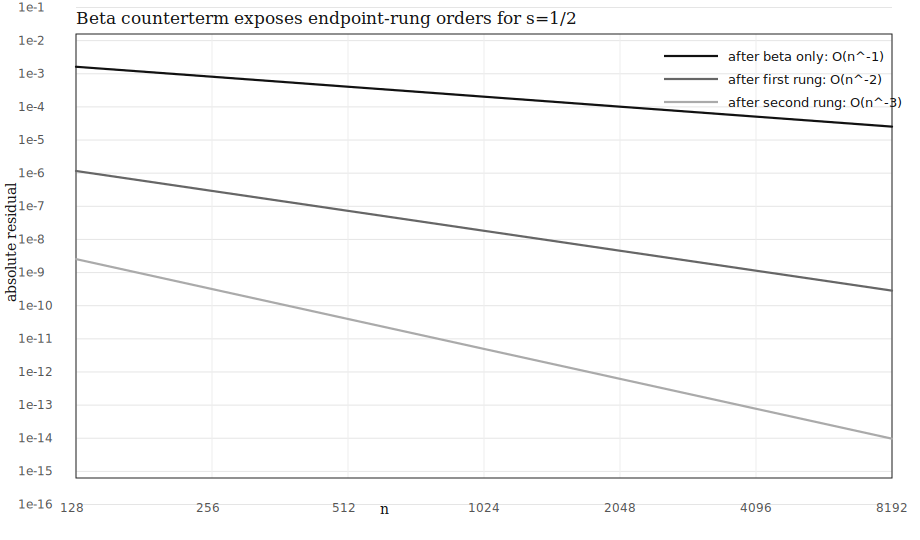
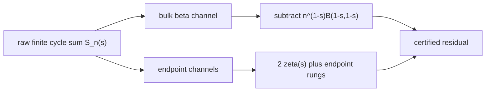
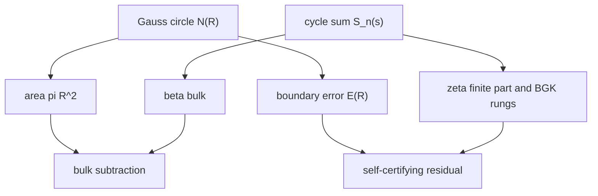

# Beta Counterterm Certificate

This certificate tests the beta counterterm as the common bookkeeping bridge
between finite-cycle zeta summation, Gauss-circle area subtraction, BGK endpoint
correction, and self-certifying Q quadrature.

The tested finite-cycle sum is

```text
S_n(s) = sum_{k=1}^{n-1} [k (1 - k/n)]^{-s}.
```

The certified ledger is

```text
S_n(s) = n^(1-s) B(1-s,1-s)
       + 2 sum_{j>=0} (s)_j zeta(s-j) n^(-j)/j!
       + residual.
```

The beta term is the bulk continuum channel.  Removing it exposes `2*zeta(s)`;
the higher powers are endpoint rungs.  This is the same structural move as
subtracting `pi R^2` from a lattice count before studying Gauss-circle boundary
error.



## Current Audit

| case | after beta | after J=1 | after J=2 | rung ratio err | status |
|---|---|---|---|---|---|
| s=1/4 | 1.0000 | 1.9997 | 3.0001 | 5.6520e-06 | PASS |
| s=1/2 | 1.0000 | 1.9999 | 3.0002 | 1.1223e-05 | PASS |
| s=3/4 | 1.0001 | 2.0000 | 3.0004 | 1.6302e-05 | PASS |
| s=1/2+0.3i | 1.0000 | 1.9999 | 3.0001 | 1.3317e-05 | PASS |
| s=1/2+2i | 1.0000 | 2.0000 | 3.0000 | 7.0769e-05 | PASS |

For the half-order case, the endpoint rungs line up as follows.

| n | |S_n| | |bulk| | beta-only error | after J=1 | after J=2 |
|---|---|---|---|---|---|
| 128 | 32.6207 | 35.5431 | 0.0016 | 1.1641e-06 | 2.5472e-09 |
| 256 | 47.3440 | 50.2655 | 8.1235e-04 | 2.9134e-07 | 3.1784e-10 |
| 512 | 68.1650 | 71.0861 | 4.0610e-04 | 7.2874e-08 | 3.9695e-11 |
| 1024 | 97.6101 | 100.5310 | 2.0303e-04 | 1.8223e-08 | 4.9597e-12 |
| 2048 | 139.2514 | 142.1723 | 1.0151e-04 | 4.5565e-09 | 6.1983e-13 |
| 4096 | 198.1412 | 201.0619 | 5.0755e-05 | 1.1392e-09 | 7.7470e-14 |
| 8192 | 281.4238 | 284.3445 | 2.5377e-05 | 2.8481e-10 | 9.6832e-15 |

The BGK half-order endpoint constant is

```text
beta_BGK = -zeta(1/2)/sqrt(2*pi)
         = 0.582597157939011.
```

The arithmetic Gauss-circle analogue in the same run is:

| R | N(R) | pi R^2 | E(R) | E(R)/pi R^2 |
|---|---|---|---|---|
| 16 | 797 | 804.248 | -7.248 | -0.0090 |
| 32 | 3209 | 3216.991 | -7.991 | -0.0025 |
| 64 | 12853 | 1.287e+04 | -14.964 | -0.0012 |
| 128 | 51433 | 5.147e+04 | -38.854 | -7.5486e-04 |
| 256 | 205861 | 2.059e+05 | -26.416 | -1.2830e-04 |

## Why the Beta Counterterm Is Not a Hack

Write `x=k/n`.  The raw sum has a bulk Riemann part:

```text
[k(1-k/n)]^(-s) = n^(-s) [x(1-x)]^(-s),
sum_k n^(-s) [x_k(1-x_k)]^(-s)
  ~ n^(1-s) int_0^1 [x(1-x)]^(-s) dx
  = n^(1-s) B(1-s,1-s).
```

That term is the wrong object if the target is the zeta finite part.  It is the
same situation as Gauss circle:

```text
N(R) = pi R^2 + E(R).
```

No one studies the raw count `N(R)` as the boundary error.  The publishable
object is `E(R)` after the area channel is repaid.  Here the publishable object
is the finite part after the beta channel is repaid.

## Endpoint Rungs

Near either endpoint,

```text
[k(1-k/n)]^(-s)
  = k^(-s) (1-k/n)^(-s)
  = k^(-s) sum_{j>=0} (s)_j (k/n)^j / j!.
```

Summing the endpoint model gives

```text
sum_k k^(j-s) = zeta(s-j)
```

by analytic continuation.  There are two endpoints, so the local repayment is

```text
2 (s)_j zeta(s-j) n^(-j) / j!.
```

The numerical certificate confirms the first three orders:

```text
after beta only:        O(n^-1)
after first endpoint:   O(n^-2)
after second endpoint:  O(n^-3)
```

## Diagram





## What This Does Not Prove

This certificate does not prove RH, and it does not by itself prove a global
continuum Q theorem.  The theorem-level target would need an explicit uniform
collar/block bound of the form

```text
sup_{s in boundary block} |R_{n,J}(s)| <= certified_bound(n,J,T),
```

strong enough for a Rouche or argument-principle zero-count transfer.  What the
present certificate proves operationally is narrower and useful: the beta
counterterm removes the continuum bulk artifact, the first endpoint rungs have
the predicted zeta coefficients, and the remaining residual decays at the
predicted powers on the tested real and complex cases.

## Reproduction

From the repository root:

```sh
PYTHONPATH=src python3 scripts/beta_counterterm_certificate.py \
  --out-dir outputs/beta_counterterm_certificate
```

Machine-readable output:

```text
outputs/beta_counterterm_certificate/beta_counterterm_certificate.json
```

Generated in `1865.8 ms` with `mpmath` precision
`80` decimal digits.
