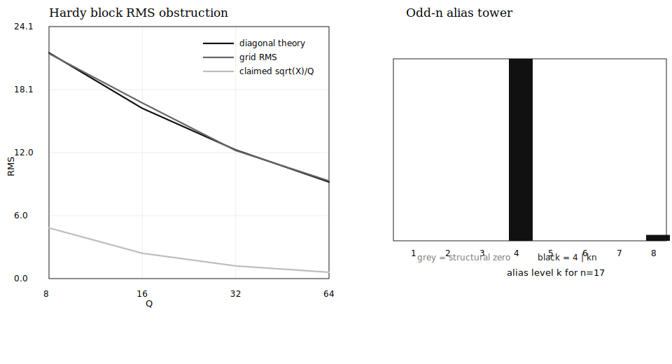

# Hardy-Voronoi Flux Certificate

This certificate records two facts that should be kept separate.

1. The dyadic Hardy-Voronoi block has a diagonal RMS floor.  A pointwise target
   below that floor cannot hold on a full collar.
2. The angular alias tower has exact Gaussian-unit cancellation: alias rungs
   vanish unless `4 | m`.

The radius interval in this script is `R in [X,2X]` with `X =
1500.0`.  Li-Yang's Gauss-circle variable is usually
`x = R^2`, so exponent comparisons must be translated before being quoted.



## Dyadic Block RMS

| Q | theory RMS | grid RMS | sqrt(X)/Q | RMS/claim | grid sup | rel. gap |
|---|---|---|---|---|---|---|
| 8 | 21.582 | 21.505 | 4.841 | 4.442 | 86.694 | 0.004 |
| 16 | 16.271 | 16.786 | 2.421 | 6.935 | 69.499 | 0.032 |
| 32 | 12.301 | 12.242 | 1.210 | 10.115 | 49.420 | 0.005 |
| 64 | 9.233 | 9.334 | 0.605 | 15.425 | 38.499 | 0.011 |

The RMS/claim ratio grows like `Q^(1/2)` up to logarithms, exactly as the
diagonal computation predicts.  Since `sup >= RMS`, this falsifies a uniform
block target of order `X^(1/2)/Q` on the full collar.

As a sanity check, the exact lattice-count error and the truncated
Hardy-Voronoi sum correlate strongly:

```text
corr(E_exact, Hardy_sum) = 0.999208
residual_rms             = 1.392511
exact_error_rms          = 35.496795
```

## Unit-Group Alias Tower

For a lattice shell, define

```text
W(nu,m) = sum over a^2+b^2=nu of cos(m arg(a+ib)).
```

The certificate checks the Gaussian-unit rule:

| m | 4 divides m | max abs W(nu,m) | shell | status |
|---|---|---|---|---|
| 1 | no | 1.332e-15 | 365 | PASS |
| 2 | no | 6.661e-16 | 260 | PASS |
| 3 | no | 3.331e-16 | 356 | PASS |
| 4 | yes | 7.898 | 313 | PASS |
| 5 | no | 4.441e-16 | 113 | PASS |
| 6 | no | 2.220e-16 | 185 | PASS |
| 7 | no | 3.331e-16 | 272 | PASS |
| 8 | yes | 13.427 | 145 | PASS |
| 9 | no | 8.882e-16 | 365 | PASS |
| 10 | no | 4.441e-16 | 290 | PASS |
| 11 | no | 6.661e-16 | 340 | PASS |
| 12 | yes | 11.800 | 265 | PASS |

For angular sampling with `n` equispaced nodes, the alias rungs have `m = k*n`.
Odd `n` kills `k = 1,2,3` because none of `n,2n,3n` is divisible by four:

| n | k | m=kn | 4 divides m | abs A(m) | structural zero |
|---|---|---|---|---|---|
| 17 | 1 | 17 | no | 2.461e-17 | yes |
| 17 | 2 | 34 | no | 1.109e-17 | yes |
| 17 | 3 | 51 | no | 3.140e-17 | yes |
| 17 | 4 | 68 | yes | 9.299 | no |
| 17 | 5 | 85 | no | 6.091e-18 | yes |
| 17 | 6 | 102 | no | 4.079e-14 | yes |
| 17 | 7 | 119 | no | 3.149e-15 | yes |
| 17 | 8 | 136 | yes | 0.302 | no |
| 16 | 1 | 16 | yes | 12.283 | no |
| 16 | 2 | 32 | yes | 11.168 | no |
| 16 | 3 | 48 | yes | 4.180 | no |
| 16 | 4 | 64 | yes | 6.528 | no |
| 16 | 5 | 80 | yes | 3.554 | no |
| 16 | 6 | 96 | yes | 3.200 | no |
| 16 | 7 | 112 | yes | 0.169 | no |
| 16 | 8 | 128 | yes | 3.944 | no |

## Reproduction

```sh
PYTHONPATH=src python3 scripts/hardy_voronoi_flux_certificate.py \
  --out-dir outputs/hardy_voronoi_flux_certificate
```

Machine-readable output:

```text
outputs/hardy_voronoi_flux_certificate/hardy_voronoi_flux_certificate.json
```

Generated in `6448.8 ms`.
