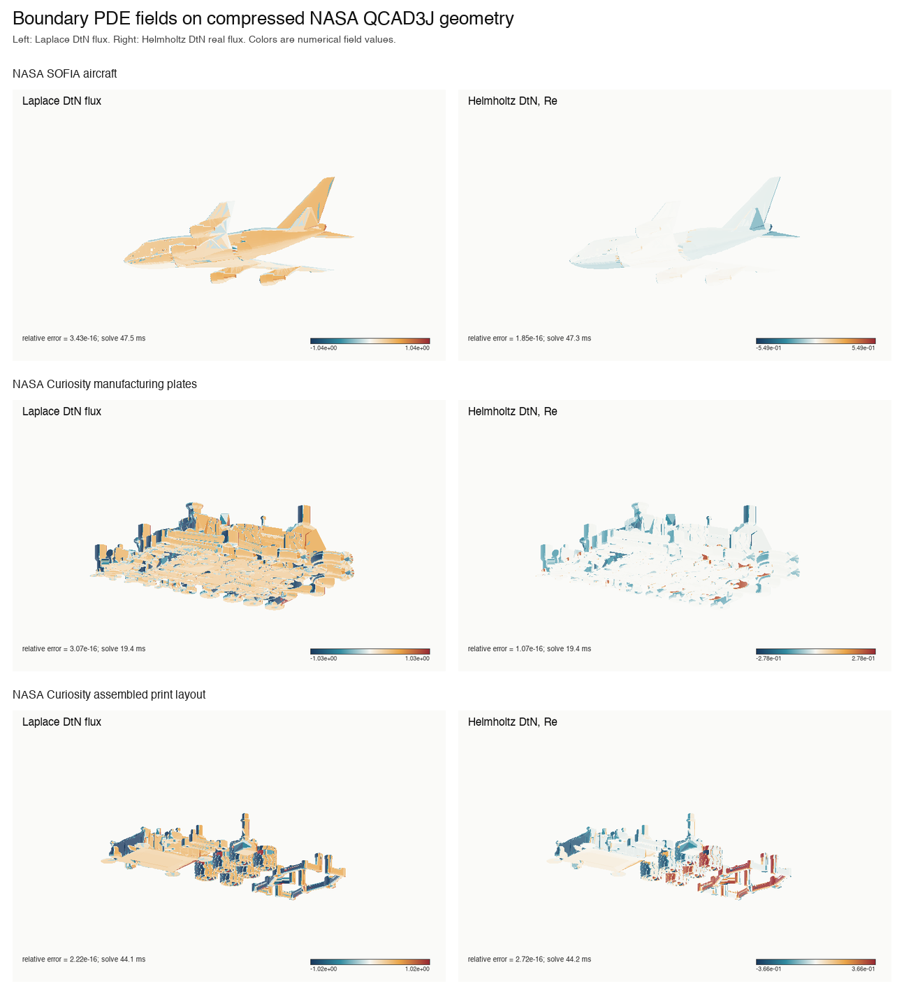
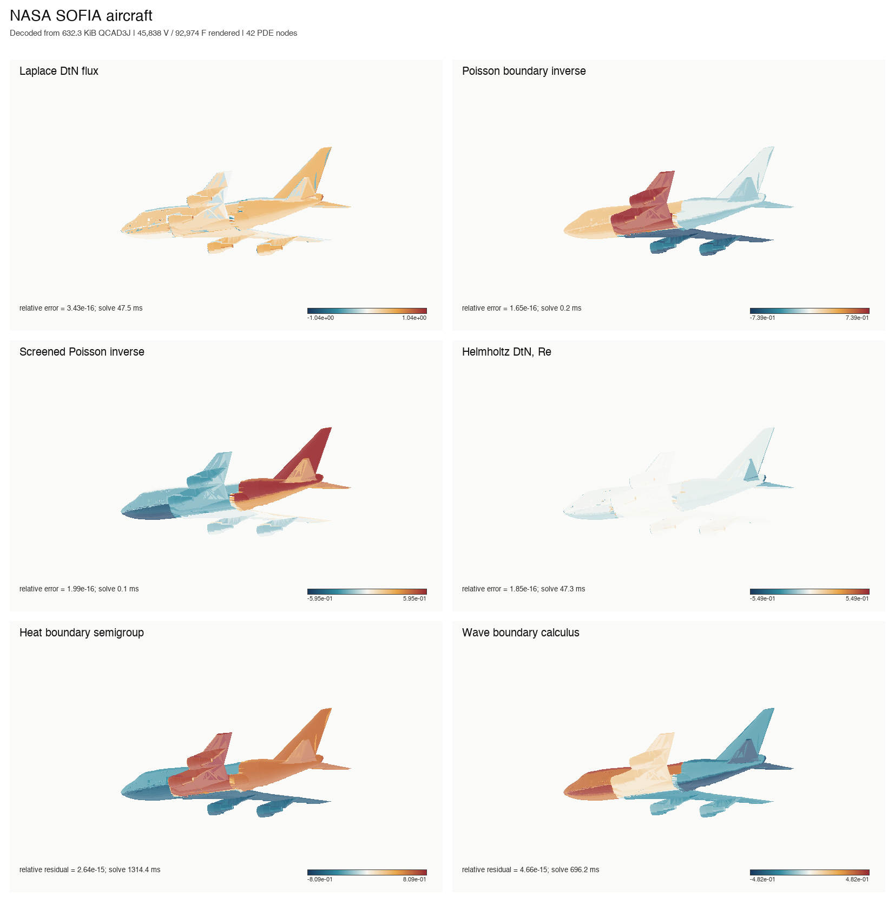
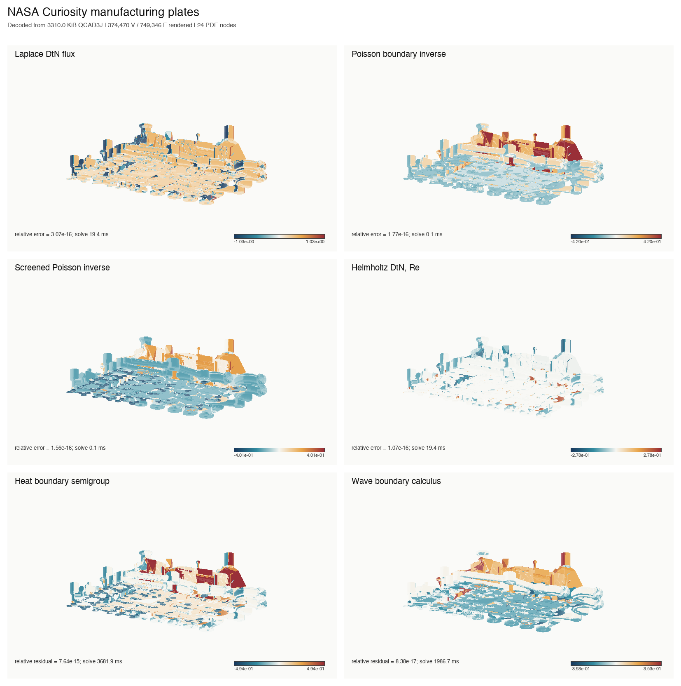
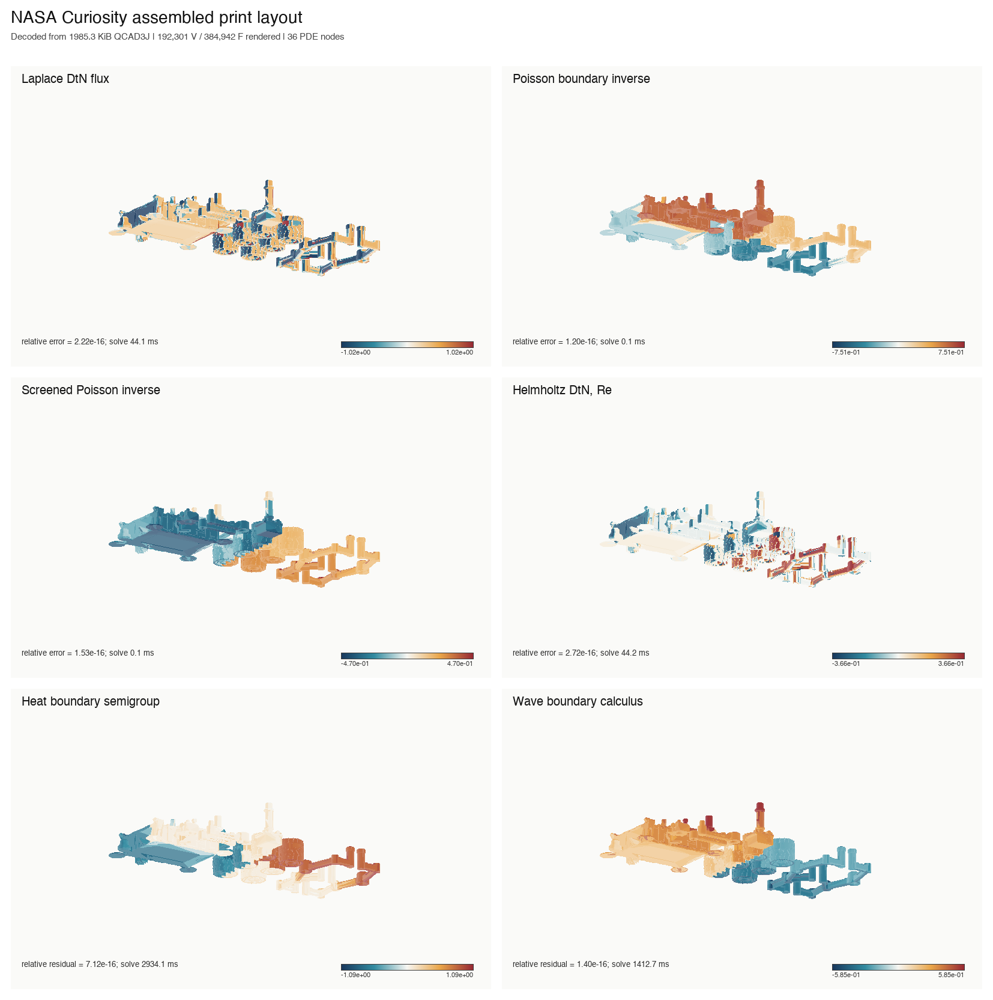

# NASA QCAD3J boundary-PDE field visualization

## Protocol

Each QCAD3J archive is checksum-decoded, compiled to a small topology-bearing boundary QJet, solved without a dense matrix, and lifted by one deterministic source-to-compiled index per source vertex. Every nondegenerate decoded triangle is then painted with the numerical field. The heatmaps are not illustrations or interpolated stock textures.

The machine-scale label is restricted to retained manufactured-reference error for Laplace, Poisson, screened Poisson, and Helmholtz, or to the algebraic denominator residual for heat and wave. It is not a held-out continuum CAD accuracy claim.
Heat and wave use the weighted self-adjoint repayment engine appropriate to semigroup and wave functional calculus; the static manufactured rows use the one-sided exact retained-reference engine.

## Geometry and cost

| NASA geometry | Archive | Source V | Source F | PDE nodes | Decode ms | Compile ms | Render ms |
|---|---:|---:|---:|---:|---:|---:|---:|
| NASA SOFIA aircraft | 632.3 KiB | 45,838 | 92,974 | 42 | 198.9 | 720.2 | 1389.3 |
| NASA Curiosity manufacturing plates | 3310.0 KiB | 374,470 | 749,346 | 24 | 1715.9 | 5780.7 | 10726.5 |
| NASA Curiosity assembled print layout | 1985.3 KiB | 192,301 | 384,942 | 36 | 841.6 | 2926.8 | 5460.2 |

## Numerical audit

Warm solve timing excludes archive decode, CAD clustering, first harmonic channel compilation, first Helmholtz channel compilation, self-adjoint evolution-channel compilation, lifting, and rendering. Those costs remain separately recorded in `geometry_rows.csv`.

| NASA geometry | Problem | Audit | Metric | Residual | Q applies | Solve ms |
|---|---|---|---:|---:|---:|---:|
| NASA SOFIA aircraft | laplace_dtn | retained manufactured reference | 3.431e-16 | 0.000e+00 | 1 | 47.5 |
| NASA SOFIA aircraft | poisson_boundary_inverse | retained manufactured reference | 1.651e-16 | 2.089e-16 | 0 | 0.2 |
| NASA SOFIA aircraft | screened_poisson_boundary_inverse | retained manufactured reference | 1.994e-16 | 1.393e-16 | 0 | 0.1 |
| NASA SOFIA aircraft | helmholtz_dtn | retained manufactured reference | 1.854e-16 | 0.000e+00 | 1 | 47.3 |
| NASA SOFIA aircraft | heat_boundary_semigroup | self-adjoint algebraic residual; no bulk or continuum claim | 2.645e-15 | 2.645e-15 | 27 | 1314.4 |
| NASA SOFIA aircraft | wave_boundary_calculus | self-adjoint algebraic residual; no bulk or continuum claim | 4.661e-15 | 4.661e-15 | 14 | 696.2 |
| NASA Curiosity manufacturing plates | laplace_dtn | retained manufactured reference | 3.067e-16 | 0.000e+00 | 1 | 19.4 |
| NASA Curiosity manufacturing plates | poisson_boundary_inverse | retained manufactured reference | 1.775e-16 | 2.041e-16 | 0 | 0.1 |
| NASA Curiosity manufacturing plates | screened_poisson_boundary_inverse | retained manufactured reference | 1.565e-16 | 3.077e-16 | 0 | 0.1 |
| NASA Curiosity manufacturing plates | helmholtz_dtn | retained manufactured reference | 1.068e-16 | 0.000e+00 | 1 | 19.4 |
| NASA Curiosity manufacturing plates | heat_boundary_semigroup | self-adjoint algebraic residual; no bulk or continuum claim | 7.638e-15 | 7.638e-15 | 189 | 3681.9 |
| NASA Curiosity manufacturing plates | wave_boundary_calculus | self-adjoint algebraic residual; no bulk or continuum claim | 8.378e-17 | 8.378e-17 | 102 | 1986.7 |
| NASA Curiosity assembled print layout | laplace_dtn | retained manufactured reference | 2.222e-16 | 0.000e+00 | 1 | 44.1 |
| NASA Curiosity assembled print layout | poisson_boundary_inverse | retained manufactured reference | 1.197e-16 | 1.592e-16 | 0 | 0.1 |
| NASA Curiosity assembled print layout | screened_poisson_boundary_inverse | retained manufactured reference | 1.528e-16 | 1.488e-16 | 0 | 0.1 |
| NASA Curiosity assembled print layout | helmholtz_dtn | retained manufactured reference | 2.719e-16 | 0.000e+00 | 1 | 44.2 |
| NASA Curiosity assembled print layout | heat_boundary_semigroup | self-adjoint algebraic residual; no bulk or continuum claim | 7.116e-16 | 7.116e-16 | 66 | 2934.1 |
| NASA Curiosity assembled print layout | wave_boundary_calculus | self-adjoint algebraic residual; no bulk or continuum claim | 1.402e-16 | 1.402e-16 | 32 | 1412.7 |

## Full six-field figures

### NASA SOFIA aircraft

### NASA Curiosity manufacturing plates

### NASA Curiosity assembled print layout

## Claim boundary

All 18 displayed rows pass their declared retained-reference or algebraic gate. The maximum retained-reference error is `3.431e-16` and the maximum heat/wave algebraic residual is `7.638e-15`.

These values verify the compressed finite-channel calculation and its linear solve. They do not override the independent held-out continuum errors reported by the separate CAD refinement campaign.
