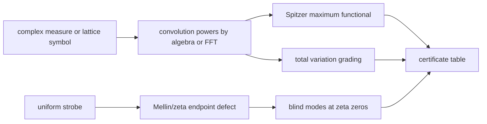
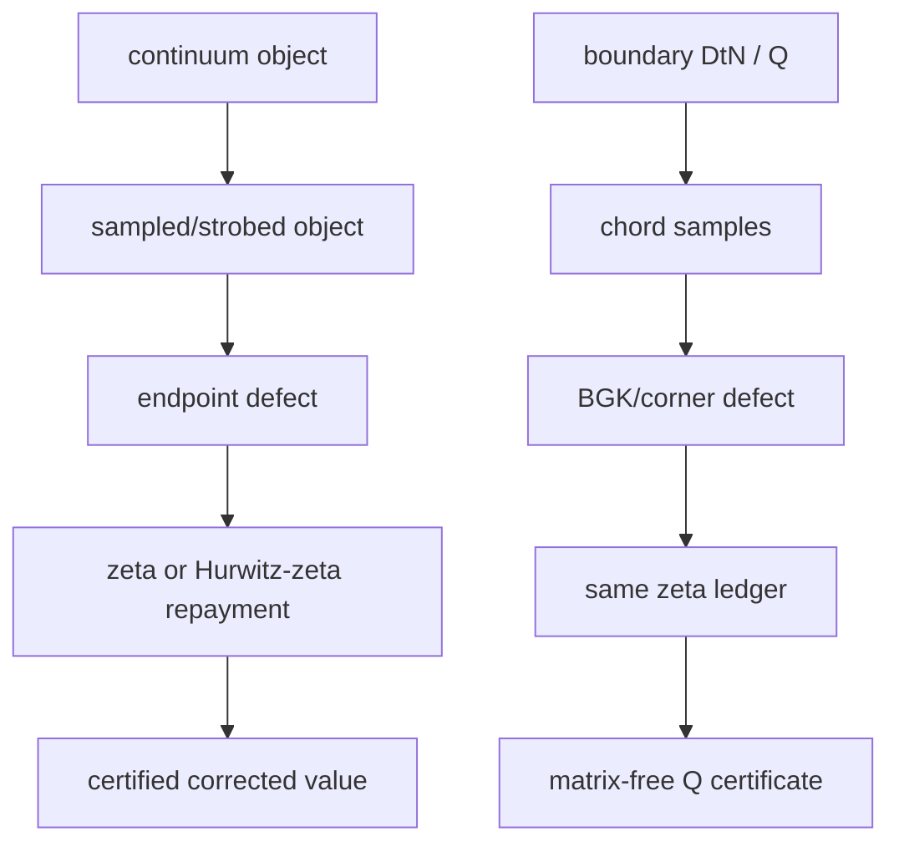
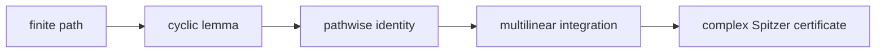
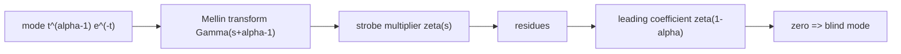
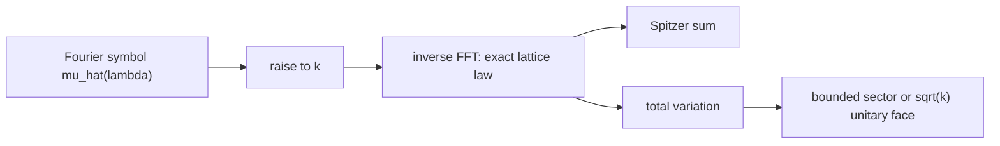
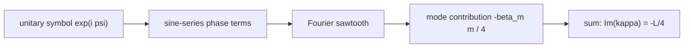

# Symbol of Observation Certificate

This folder is an executable audit of the paper `symbol_of_observation (1).pdf`.
The point is not to numerically sample paths. The point is to certify that the
paper's observation calculus can be checked by finite algebra, zeta/strobe
asymptotics, and FFT evaluation of exact lattice symbols.

The certificate answers four questions.

1. Does Spitzer's maximum identity survive when the path weights are complex?
2. Does the uniform strobe really see zeta values as its endpoint defect?
3. Does a zeta zero make a mode blind to leading order?
4. On the unitary face, is the imaginary part of the fluctuation constant the
   sawtooth value `-L/4`?

The current full run passes all checks:

| Check | Result | Numerical anchor |
|---|---:|---|
| C1 complex Spitzer identity | PASS | `|direct - Spitzer| = 3.98e-14` |
| C2 strobe transfer | PASS | error slope `1.205890` vs `1.215649` |
| C3 first-zero blind mode | PASS | `|R|/Delta = 1.215562` vs `1.225463` |
| C4 simple random walk anchor | PASS | `c(4000) = -0.500000` |
| C5 dissipative sector TV limit | PASS | `1.189172` vs `1.189207`; `1.414125` vs `1.414214` |
| C6 unitary-face TV growth | PASS | `TV/sqrt(k) = 1.230578` vs Watson `1.217188` |
| C9 sawtooth law | PASS | Im constants match `-L/4` to `2e-5` |

The machine-readable artifact is
[`symbol_of_observation_certificates.json`](symbol_of_observation_certificates.json).
The compact audit table is
[`symbol_of_observation_certificates.md`](symbol_of_observation_certificates.md).

## How to Run

From the repository root:

```sh
PYTHONPATH=src python3 scripts/symbol_of_observation_certificates.py \
  --pdf "/Users/rick/Downloads/symbol_of_observation (1).pdf" \
  --profile full \
  --out-dir outputs/symbol_of_observation
```

The `quick` profile uses smaller horizons for iteration:

```sh
PYTHONPATH=src python3 scripts/symbol_of_observation_certificates.py \
  --pdf "/Users/rick/Downloads/symbol_of_observation (1).pdf" \
  --profile quick \
  --out-dir outputs/symbol_of_observation
```

The full profile used here runs in a few seconds on a laptop and uses
`NFFT = 16384` for the lattice-symbol checks.

## Big Picture

The paper replaces positivity with contraction. A classical probability measure
has nonnegative mass and total variation one. A complex probability in the
paper is allowed to have complex weights, but its Fourier transform is required
to be contractive:

```text
mu(R) = 1,                    |mu_hat(lambda)| <= 1.
```

That single change separates two questions that are often mixed together.

| Question | Classical probability | Complex probability |
|---|---|---|
| Can I sample paths as probabilities? | yes | not always |
| Can I evaluate the path algebra? | yes | yes, if the symbol is contractive |

The certificate checks the second column. It evaluates the algebra directly.
No Monte Carlo sampling is used.



## The Shared Ledger with Q/BGK

This certificate is relevant to the Q boundary/PDE work because it exercises
the same bookkeeping pattern:

```text
borrow      ->  compute on a simple spectral coordinate  ->  repay endpoint/metric defect
circle/Q    ->  Fourier or QJet symbol action             ->  BGK/zeta/corner correction
strobe      ->  lattice/Mellin symbol action              ->  zeta endpoint correction
```

In both cases, the leading error is not "random noise." It is a deterministic
endpoint or boundary-discretization defect. The correction constant is a zeta
or Hurwitz-zeta term. This is exactly why the BGK correction belongs in the Q
pipeline: it is the translator between a continuum boundary or barrier and a
discrete monitored grid.



## Certificate C1: Spitzer over Complex Measures

Let `S_k = X_1 + ... + X_k` and `M_n = max(0, S_1, ..., S_n)`.
For ordinary random walks, Spitzer's identity says

```text
E[M_n] = sum_{k=1}^n E[S_k^+] / k.
```

The certificate checks this with a complex three-point measure:

```text
mu = (0.3 + 0.4i) delta_1 + (0.5 - 0.1i) delta_0 + (0.2 - 0.3i) delta_-1.
```

Because `n = 7`, the direct side is exactly enumerable:

```text
direct = sum over 3^7 paths of weight(path) * max(partial sums).
```

The Spitzer side is also exactly enumerable:

```text
spitzer = sum_{k=1}^7 (1/k) * sum over 3^k paths of weight(path) * positive_part(S_k).
```

The result is:

```text
E[M_7] = -0.1141994 + 3.2746358 i
|direct - Spitzer| = 3.98e-14.
```

### Proof Sketch

Spitzer's identity is multilinear in the path weights. The usual proof uses a
cyclic rearrangement lemma on finite paths. That lemma is pathwise: it does not
need positivity, monotonicity, or sampling. Once the finite identity is true for
each path, integration against a product complex measure is just finite
linearity. The certificate verifies the resulting identity by brute force.



## Certificates C2 and C3: Strobe Transfer and Blindness

The uniform strobe samples a continuum function at a mesh `Delta`:

```text
S_Delta f = Delta * sum_{k >= 1} f(k Delta).
```

For the mode

```text
f_tau(t) = t^(-1/2 + i tau) exp(-t),
alpha = 1/2 + i tau,
```

the continuum integral is `Gamma(alpha)`. The strobe defect is normalized as

```text
R(tau, Delta) =
  (S_Delta f_tau - Gamma(alpha)) / Delta^alpha.
```

Euler-Maclaurin/Mellin transfer gives the expansion

```text
R(tau, Delta)
  = zeta(1/2 - i tau)
    + zeta(-1/2 - i tau) Delta
    + O(Delta^2).
```

C2 tests `tau = 14`, where the leading zeta term is not zero. The measured
error to `zeta(1/2 - 14i)` is linear in `Delta`, and the slope tends to
`|zeta(-1/2 - 14i)|`.

C3 tests `tau = gamma_1`, the first nontrivial zeta-zero ordinate. Since

```text
zeta(1/2 - i gamma_1) = 0,
```

the leading term disappears:

```text
R(gamma_1, Delta) = zeta(-1/2 - i gamma_1) Delta + O(Delta^2).
```

That is what "blind mode" means here: the uniform strobe does not see the mode
at leading order.

### Proof Sketch

The Mellin transform of `f_tau` is

```text
M f_tau(s) = Gamma(s + alpha - 1).
```

The strobe sum is a Mellin inversion with a zeta multiplier:

```text
S_Delta f - integral(f)
  = sum of residues of Gamma(s + alpha - 1) zeta(s) Delta^(1-s).
```

The pole at `s = 1 - alpha` contributes `zeta(1 - alpha) Delta^alpha`.
Dividing by `Delta^alpha` gives `zeta(1 - alpha)`. The next pole contributes
`zeta(-alpha) Delta`. If `1 - alpha` is a zeta zero, the first coefficient is
zero, so the normalized defect is one order smaller.



## Certificates C4-C6: FFT-Spitzer Walks and Sign-Problem Grading

For lattice walks, the convolution powers are evaluated by their Fourier
symbols:

```text
law(S_k) = inverse_fft(mu_hat(lambda)^k).
```

Then Spitzer computes the maximum:

```text
E[M_n] = sum_{k=1}^n E[S_k^+] / k.
```

The certificate checks three regimes.

| Regime | Symbol | Expected behavior |
|---|---|---|
| Classical simple random walk | `mu_hat = cos(lambda)` | `TV_k = 1`, anchor constant `-1/2` |
| Open dissipative sector | `exp(-e^{i theta}(1-cos lambda))` with `theta < pi/2` | `TV_k -> sec(theta)^(1/2)` |
| Unitary face | same symbol with `theta = pi/2` | `TV_k = O(sqrt(k))` |

The total variation is the computational cost proxy for direct signed or
complex-weight Monte Carlo. In the open sector it is bounded. On the unitary
face it grows like `sqrt(k)`. Outside contraction it would grow exponentially.

### Proof Sketch

The FFT computes exact periodic lattice convolution to floating-point
precision. Near `lambda = 0`,

```text
mu_hat(lambda) ~= exp(-sigma^2 lambda^2 / 2).
```

So the local central-limit form controls the large-`k` law. If
`Re(sigma^2) > 0`, the absolute mass converges to the Fresnel-Gauss total
variation:

```text
sec(arg sigma^2)^(1/2).
```

On the unitary face, `|mu_hat| = 1`, so there is no damping. Stationary-phase
and Bessel asymptotics replace Gaussian decay and give `TV_k = O(sqrt(k))`.



## Certificate C9: The Sawtooth Law

On the unitary face, the symbol is written

```text
mu_hat(lambda) = exp(i psi(lambda)),
psi(lambda) = sum_m beta_m (cos(m lambda) - 1).
```

Define the hopping-range ledger

```text
L = sum_m beta_m m.
```

The paper claims that the imaginary part of the fluctuation constant is exactly

```text
Im(kappa) = -L / 4.
```

The certificate tests three Hamiltonians:

| Case | `beta` | `L` | target `-L/4` | measured |
|---|---:|---:|---:|---:|
| `beta_1_1over4` | `(1, 1/4)` | `3/2` | `-0.375000` | `-0.374998` |
| `beta_1_minus1over8` | `(1, -1/8)` | `3/4` | `-0.187500` | `-0.187498` |
| `beta_half_0_half` | `(1/2, 0, 1/2)` | `2` | `-0.500000` | `-0.499981` |

### Proof Sketch

The imaginary part comes from the sine series

```text
sum_{k >= 1} sin(k theta) / k,
```

which is the Fourier sawtooth. On `theta in (-2 pi, 0)`,

```text
sum_{k >= 1} sin(k theta) / k = -(pi + theta) / 2.
```

Each hopping mode contributes a scaled sawtooth. Summing the modes leaves the
simple endpoint value `-1/4 * sum_m beta_m m = -L/4`. The certificate extracts
the limiting constant by Richardson extrapolation from the FFT-Spitzer
sequence.



## What This Does Not Claim

The audit is deliberately scoped.

- It does not prove the Riemann Hypothesis.
- It does not claim arbitrary complex weights are probabilistically samplable.
- It does not replace the analytic proofs in the PDF.
- It does not use Monte Carlo evidence.

It does provide a reproducible numerical checksum for the paper's executable
claims: complex Spitzer algebra, strobe/zeta transfer, first-zero blindness,
FFT-Spitzer fluctuation constants, total-variation grading, and the unitary
sawtooth law.

## Relation to Production Q

The production Q engine uses the same engineering idea in a different domain.

| Observation certificate | Boundary Q certificate |
|---|---|
| strobe samples `f(k Delta)` | boundary samples `gamma(theta_j)` |
| Mellin/zeta endpoint defect | BGK/Hurwitz/corner endpoint defect |
| Fourier symbol `mu_hat(lambda)` | Q spectrum / DtN symbol |
| no Monte Carlo paths | no dense Q matrix |
| exact algebra plus repayment | borrow-compute-repay QJets |

The certificate therefore strengthens the narrative around the Q pipeline: in
both path monitoring and boundary quadrature, the hard part is not random
sampling. The hard part is deterministic endpoint bookkeeping. Once that
bookkeeping is exposed as a spectral/zeta ledger, the computation becomes a
matrix-free certificate rather than a mesh or Monte Carlo estimate.

