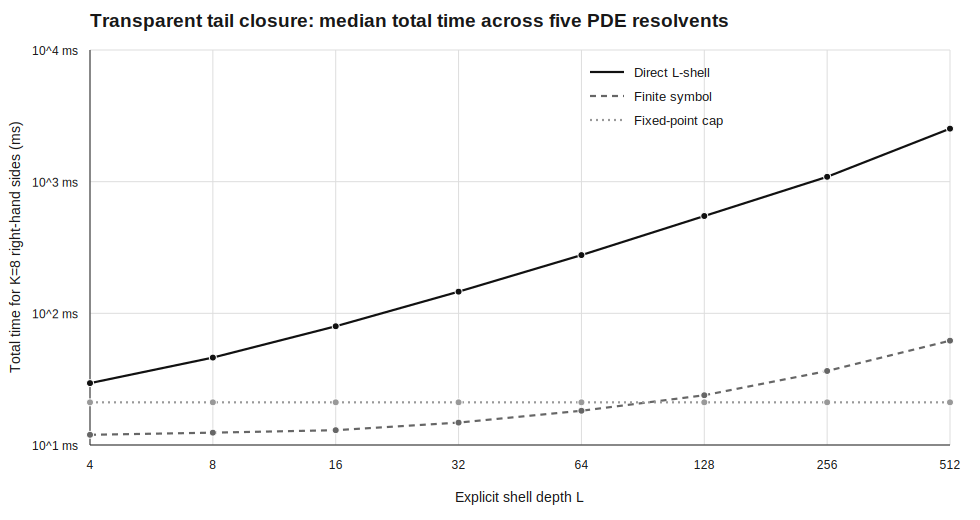

# Exact transparent-tail benchmark

This campaign compares a streamed direct L-shell tridiagonal solve, a compiled finite-Dirichlet Riccati symbol, and the exact fixed-point transparent cap. All methods use the same custom angular QJet FFT; no dense shell or boundary matrix is formed.

## PDE coverage

| Problem | Shift | max |w| | Fixed-point residual |
|---|---:|---:|---:|
| laplace | `0+0i` | 1.000000 | 8.882e-16 |
| screened_poisson | `0.36+0i` | 0.553582 | 8.882e-16 |
| heat_resolvent | `0.4+0i` | 0.536675 | 8.882e-16 |
| helmholtz | `-0.49+0.2i` | 0.860917 | 2.036e-15 |
| wave_resolvent | `-0.45+0.28i` | 0.808209 | 1.845e-15 |

## Deep-tail comparison

The table uses `N_theta=128`, `K=8`, and `L=512`. Timings are measured wall times on this machine.

| Problem | Direct ms | Finite-symbol ms | Cap ms | Direct/cap | Finite error |
|---|---:|---:|---:|---:|---:|
| laplace | 2546.426 | 61.234 | 20.558 | 123.9x | 1.000e-14 |
| screened_poisson | 2527.967 | 62.001 | 20.413 | 123.8x | 0.000e+00 |
| heat_resolvent | 2514.509 | 59.768 | 21.090 | 119.2x | 0.000e+00 |
| helmholtz | 2512.953 | 62.025 | 23.370 | 107.5x | 2.464e-16 |
| wave_resolvent | 2551.029 | 62.952 | 22.052 | 115.7x | 3.597e-16 |

## Certificates

- Maximum direct/finite disagreement: `1.827e-14`.
- Maximum fixed-point residual: `2.036e-15`.
- Maximum cross-ratio linearization residual: `1.282e-14`.
- Cylinder generator identity residual: `1.055e-15`.
- Golden depth 20 pivot: `F_42/F_40 = 267914296/102334155`; error-law residual `4.270e-17`.
- Summably perturbed transition: actual pivot defect `2.808e-02` under certified bound `2.808e-02`.

The fixed-point row has zero autonomous-tail truncation error by the proved Schur identity. That statement is stronger than convergence against a long finite tail, but narrower than a continuum claim on an arbitrary CAD surface.

## Complexity

- Direct streamed shells: `O(K N_theta L + K N_theta log N_theta)` time and `O(N_theta + L)` working storage.
- Compiled finite tail: `O(N_theta L)` setup, then `O(K N_theta log N_theta)` application and `O(N_theta)` storage.
- Exact cap: `O(N_theta)` setup, `O(K N_theta log N_theta)` application, and `O(N_theta)` storage, independent of `L`.

## CAD accuracy scope

This cap closes an autonomous cylindrical or conic end. The held-out public-CAD campaign instead compresses each source mesh to 48–155 operator vertices and tests an unseen degree-four continuum harmonic against a degree-three compiler. The separate NASA display gallery uses 24–42 nodes but reports only retained-channel or finite-equation audits. The cap does not reconstruct those discarded surface channels.
